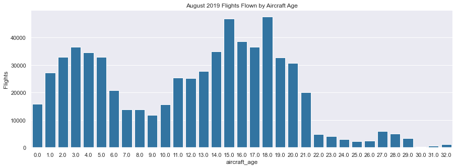
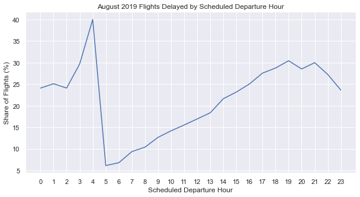
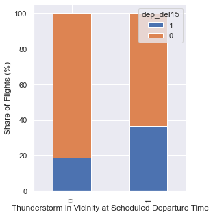

# Will Your Flight Be Delayed?
### Project Overview
  * PURPOSE 
  * Scraped more than 5000 aircraft registrations from the FAA website using python and beautifulsoup.
  * Engineered features from aviation weather report text (METARs) to indicate the presence of fog or thunderstorms at the scheduled departure time.
  * Performed a complex T-SQL join of the flight and weather data on the closest weather report timestamp to the scheduled departure time.
  * Optimized logistic regression, decision tree, and random forest models using GridSearchCV to improve model performance in an unbalanced classifcation problem. 
  
  
## Tools and Resources Used
**Python**: 3.8  
**Packages**: numpy, pandas, matplotlib, seaborn, sklearn, beautifulsoup4, grequests  
**SQL Server**: 2019  
**Calculating Greatest Circle Distance**: [https://medium.com/analytics-vidhya/finding-nearest-pair-of-latitude-and-longitude-match-using-python-ce50d62af546](https://medium.com/analytics-vidhya/finding-nearest-pair-of-latitude-and-longitude-match-using-python-ce50d62af546)
## Data Collection  
If a domestic flight was delayed in the United States in 2019, the delay typically fell into to one of three main categories of delays, a weather delay (high winds, thunderstorms, freezing rain etc.), an airline delay (mechanical problem, schedule knock-on effects etc.), or an air system delay (airport congestion, waiting for de-icing or refueling services etc.).  

To accuratly predict if a flight would be delayed several hours prior to its departure, we need data that relates to each type of commonly experienced delay. The following data sources were decided upon:  

  * **Airline On-Time Performance Data**
      * Source: [United States Department of Transportation (Bureau of Transportation Statistics)](https://www.transtats.bts.gov/Tables.asp?DB_ID=120&DB_Name=Airline%20On-Time%20Performance%20Data&DB_Short_Name=On-Time)
  * **Airport Weather Reports from FAA Managed Weather Stations**
      * Source: [National Centers for Environmental Information - U.S. Local Climatological Data (LCD)](https://www.ncei.noaa.gov/access/metadata/landing-page/bin/iso?id=gov.noaa.ncdc:C00684)
  * **Aircraft Registration Data**  
      * Source: web scraped via the FAA aircraft registration website.  
  * **Airport Locations**
      * Source: [https://github.com/datasets/airport-codes](https://github.com/datasets/airport-codes)
  
    
### FAA Aircraft Registration Web Scraper

For each aircraft tail number, also known as an N-number, the following registration information was collected:
  * Active Aircraft:
    * Aircraft Model
    * Engine Model
    * Manufacturer Year
  * Deregistered Aircraft:
    * Manufacturer Year
    * Registration Cancellation Date
    
To reduce load on the server, requests were sent in batches of 10 rather than individually as we have thousands of unique urls.  
## Data Cleaning
**Airline On-Time Performance Data:**
  * Created columnns for whether the departure or arrival airport was slot controlled.
  * Determined which flights were operated by a swapped aircraft, and removed them.
    * Removed because the tail number assigned to each flight was of the aircraft that actually operated the flight, and not necessarily the one that caused the delay. 
  * Adjusted aircraft tail numbers (N-number) to ensure they all begin with 'N'.
  * Created a list of all unique tail numbers in the dataset to feed into the aircraft registration scraper.

**Airport Weather Reports:**
  * Created columns from METAR text to indicate the presence of fog, thunderstorms, or rain. 
  * Used regular expressions to extract the numerical component of the recorded wind speed.
  * Conformed all visibility entries to the aviation standard of 0 - 10 statute miles.  

**Scraped Aircraft Registration Data:**  
  * Used regular expressions to remove all year and date values that had incorrect formatting.
  * Built a function to identify the correct manfucturer year for tail numbers that had multiple aircraft on the registration record. 
  * Calculated the approximate aircraft age in August 2019. 
  
**Airport Location Data:**
  * Filtered the data to contain only the unique airports found in the Airline On-Time Performance Data.
  * For each unique airport, determined the closest weather station in the Airport Weather Report Data.

## Exploratory Data Analysis

 
## Model Building
## Closing Remarks
